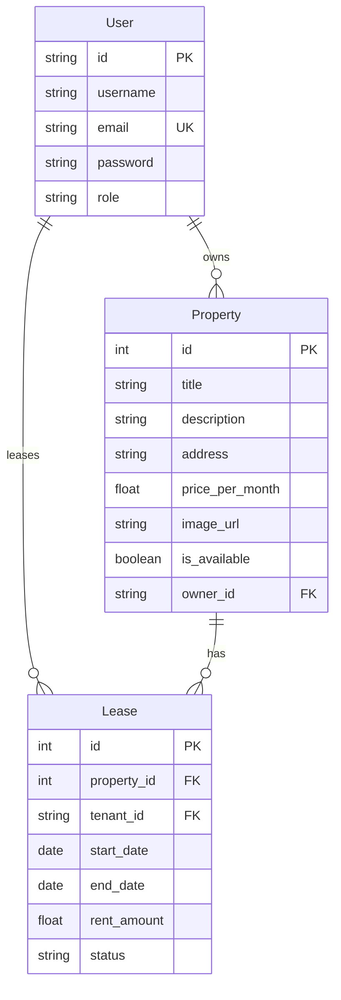

# RentFlow - Rental Management System

RentFlow is a modern, high-fidelity, single-page full-stack web application designed for landlords to list properties and manage tenancies, and for tenants to find homes and execute digital lease agreements. It features a stunning glassmorphic UI, smooth micro-animations, and a highly responsive green-blue cursor-following liquid wave glow.

---

## 🛠️ Technology Stack & Architecture

### Backend (Core API)
*   **FastAPI**: Asynchronous, high-performance web framework for building Python APIs.
*   **SQLAlchemy ORM**: Relational database mapping using declarative bases, structuring relationships.
*   **Pydantic**: Robust data validation and serialization schemas.
*   **JWT Authentication**: Secure, stateless user sessions utilizing Access tokens (HMAC-SHA256, `HS256`, 30-min expiry) and Refresh tokens (7-day expiry) for seamless token refreshes.
*   **Argon2 / Bcrypt**: Hashed and salted passwords using `bcrypt` via `passlib`.
*   **SQLite**: File-based database engine (`rental_system.db`) for rapid local development.
*   **Uvicorn**: Asynchronous ASGI web server implementation.

### Frontend (SPA Engine)
*   **HTML5**: Clean, SEO-optimized semantic markup.
*   **Vanilla CSS**: High-end styling utilizing custom design system tokens, CSS variables, glassmorphic filters, responsive grids, and hardware-accelerated animations.
*   **Vanilla Javascript**: Single-Page Application (SPA) routing, state management (token preservation, user role persistence), responsive DOM rendering, and debounced discovery searches.
*   **Lucide Icons**: Scalable SVG iconography.
*   **Smooth Easing Cursor Glow**: Double-layered cursor tracking system using linear interpolation (`lerp`) and continuous liquid blob morphing (`@keyframes morphWave`) via `requestAnimationFrame`.

---

## 🚀 Key Features

*   **Role-Based Access Control (RBAC)**: Distinct layouts, views, and APIs for `landlord` and `tenant` users.
*   **Property Discovery Feed**: Search listings by keyword, availability status, or price thresholds.
*   **Lease Estimation & Management**:
    *   Automatic month-duration and cost commitment calculations based on lease dates.
    *   One-click digital signature contracts that toggle property availability.
    *   Lease termination routines that release properties back to the pool instantly.
*   **Landlord Dashboard Analytics**: Metrics calculation on properties owned, current occupancy percentage, and total monthly rent revenue.
*   **Custom Property Media**: Landlords can specify custom internet image URLs (e.g., from Unsplash) when publishing listings.

---

## 🇮🇳 Indian Localization & Customization

The system is custom-tailored for the Indian market, focused on **Pune, Maharashtra**:
*   **Geographical Listings**: Default properties are pre-seeded around popular Pune localities like *Kalyani Nagar*, *Koregaon Park*, *Kothrud*, and *Baner*.
*   **INR Currency Integration**: Prices and values are formatted using the Indian Numbering System (`toLocaleString('en-IN')` with the `₹` prefix, e.g., `₹75,000/mo`).
*   **Google Maps Redirection**: All addresses render as clickable links with location pointers. Clicking a location immediately opens Google Maps with the address string.
*   **Liquid Green-Blue Glow**: An ambient background glow of cyan (`rgba(6, 182, 212, 0.28)`), mint green (`rgba(16, 185, 129, 0.12)`), and sky blue (`rgba(14, 165, 233, 0.03)`) dynamically follows the cursor. It operates at low latency (`speed = 0.16`) and morphs shapes independently.

---

## 📂 Project Directory Structure

```text
├── app/
│   ├── __init__.py
│   ├── app.py             # FastAPI app endpoints, routes, middleware, and files serving
│   ├── database.py        # SQLAlchemy database engine connection and session providers
│   ├── dependencies.py    # Authentication middleware, current user extraction, and role checks
│   ├── models.py          # SQLAlchemy models (User, Property, Lease schemas)
│   ├── schemas.py         # Pydantic models for REST payload validation
│   └── utils.py           # Password hashing verification and JWT generation helpers
├── static/
│   ├── css/
│   │   └── styles.css     # CSS variable tokens, glassmorphism, responsive grids, and morph keyframes
│   ├── images/
│   │   └── prop*.png      # Local static image placeholders
│   ├── js/
│   │   └── app.js         # Frontend SPA router, state manager, API fetch, and cursor follow animations
│   └── index.html         # Main dashboard markup structure and modals
├── .env                   # Local configuration (database URL, secret keys)
├── seed.py                # Database setup script (creates schema tables and seeds initial mock data)
├── requirements.txt       # Python environment library list
└── README.md              # Full system documentation
```

---

## 📊 Database Architecture

The database model relationships are outlined below:



---

## 🚦 Setup & Getting Started

### 1. Environment Setup
Clone the repository and create/activate a virtual environment:
```bash
# Create environment
python -m venv fastapienv

# Activate (Windows)
fastapienv\Scripts\activate

# Activate (macOS/Linux)
source fastapienv/bin/activate
```

### 2. Install Libraries
Install all backend dependencies:
```bash
pip install -r requirements.txt
```

### 3. Configure Settings
Create a `.env` file in the project root:
```env
DATABASE_URL=sqlite:///./rental_system.db
JWT_SECRET_KEY=38b693b7ff6c2dc1b11b98f26dbca90d165fcf26095be9c2f6d2f3a9e6dcf3d0
JWT_REFRESH_SECRET_KEY=b9148d42d3856e79adfa7ef12b5006b5394efbdde494cbbfd6fbf383a54b38ff
```

### 4. Create & Seed Database
Initialize schema tables and populate localized database entries:
```bash
python seed.py
```

### 5. Launch Local server
Start the Uvicorn ASGI server:
```bash
python -m uvicorn app.app:app --host 127.0.0.1 --port 8000
```
Open your browser and navigate to: **`http://127.0.0.1:8000/`**

*   **API Docs (Swagger UI)**: [http://127.0.0.1:8000/docs](http://127.0.0.1:8000/docs)
*   **Redoc Alternative**: [http://127.0.0.1:8000/redoc](http://127.0.0.1:8000/redoc)

---

## 🔑 Seeding / Testing Credentials

You can sign in with the following default accounts created by `seed.py`:

*   **Landlord Account**:
    *   **Email**: `landlord@rentflow.in`
    *   **Password**: `password123`
*   **Tenant Account**:
    *   **Email**: `tenant@rentflow.in`
    *   **Password**: `password123`

---

## 🤖 LLM Integration Guide & Context

If you are using an LLM (like Claude, Gemini, or ChatGPT) to debug or scale this codebase, pass this guide to provide context:
1.  **SPA Routing**: Navigating is client-side. The DOM transitions between elements (`#view-explore`, `#view-dashboard`, `#view-leases`) using the `switchView(viewId)` helper in `app.js`.
2.  **Auth tokens**: Authentication headers are stored inside `state.token` and appended inside the `API.request` interceptor.
3.  **Property Images**: Rendering checks `prop.image_url` first. If blank, it checks the description for markdown links before falling back to index-based premium Unsplash images.
4.  **Cursor Follower**: The HTML contains `.cursor-glow > .glow-wave`. `app.js` runs a lerping frame loops modifying `cursorGlow.style.transform = translate3d(...)` which matches CSS `.glow-wave` keyframe coordinates.
